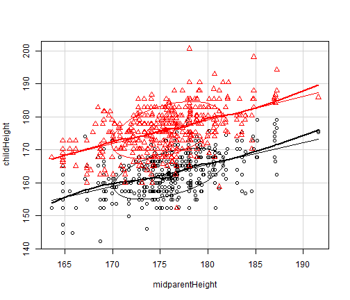

## Cousera Shiny Application and Reproducible Pitch

Krystian Szczucki

2016-03-06

--- .class #id 

## Introduction to my shiny app

This App will use the GaltonFamilies data to predict the children height based on it's parents height.

This App calculates childer height and displays it on a ggplot bar along with it's parents height. 

[Link to my app on shinyapps] (https://kszczucki.shinyapps.io/shiny_project/) 

[Link to my github repo] (https://github.com/kszczucki/coursera-data-product)


--- .class #id 

## Galton dataset

Description

This data set lists the individual observations for 934 children in 205 families on which Galton (1886) based his cross-tabulation.

In addition to the question of the relation between heights of parents and their offspring, for which this data is mainly famous, Galton had another purpose which the data in this form allows to address: Does marriage selection indicate a relationship between the heights of husbands and wives, a topic he called assortative mating?

http://www.inside-r.org/packages/cran/HistData/docs/GaltonFamilies

--- .class #id 

## Galton dataset

```r
require(ggplot2)
library(HistData)
data(GaltonFamilies)

library(car)
GaltonFamilies$childHeight <- GaltonFamilies$childHeight * 2.54
GaltonFamilies$midparentHeight <- GaltonFamilies$midparentHeight * 2.54
scatterplot(childHeight ~ midparentHeight | gender, data=GaltonFamilies,
     ellipse=TRUE, levels=0.68, legend.coords=list(x=64, y=78))
```



--- .class #id 

## Shinyapp
Below you can find a screenshot of my application.  


Thanks for your time and have a nice day.

